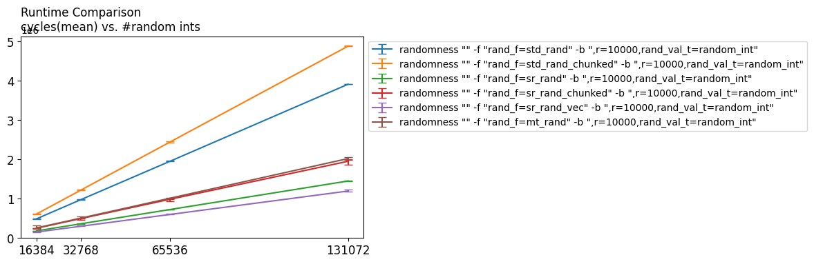

# Optimizations

Note: Please read the report for the most up to date analysis.

[Analysis Polytope and PolytopeT](./optimizations/analysis_polytope.md)

[Analysis PolytopeCSC](./optimizations/analysis_polytopeCSC.md)

[Analysis PolytopeJIT](./optimizations/analysis_polytopeJIT.md)

[Analysis Ellipsoid](./optimizations/analysis_ellipsoid.md)

[VTune Analysis](./optimizations/vtune_analysis)

## Most important points

* What we already did:
  * Extended algo for Polytopes to also deal with Ellipsoids
  * Tried intersect vs intersectCoord
    * intersectCoord is much faster, not much worse in convergence
    * we will not persue intersect further, it only consists of dotProducts anyway
  * intersectCoord profits if Polytope matrix in column format (Polytope vs PolytopeT)
  * Polytope.intersectCoord faster if cache dotProducts
* often dimensions of vectors/matrices are rather low (10-100)
  * so it may not be possible to reach max performance (op density)

* What we will still do:
  * PolytopeT.intersectCoord
    * vectorize, convert if/min/max (seem to cost most now)
  * Ellipsoid.intersectCoord
    * try to cache and vectorize
    * Else: vectorize MVM
  * Sparse bodies
  * JIT
  * improve prng, mostly relevant for random direction intersection/sparse bodies
  
* What we could do if we have enough time:
  * parallelize sample point x
    * would lead to MMM for random direction intersect
    * Could increase op density
* extend to other convex quadratic bodies
  * Benchmark Polyvest to show how we compare
    - performance count, convergence, match for exact parameters
  
* A word on preprocessing
  * Ellipsoid method (shallow-cut), implemented but will not optimize (scope)
  * Cholesky decomp, matrix inverse, Sherman-Morisson, ...
  * minimize quadratic function constrained to ellipsoid
  * Lots of MVM, some MMM
  * numerical precision issues

## Detailed discussion

* dotProduct / squaredNorm
  * 2 accumulators brought some speedup
  * input too small often - vectorization so far lead to no speedup
  * max 4 fps, fast around n=100, 2 fps below n=30
  * vectorization causes overhead to reduce final sum vector
  * could implement versions for different n?
  * squaredNorm should also be checked - not benchmarked yet

* Ball\_intersect
  * at about 2 fpc
  * basically 2 squaredNorms and a dotProduct
  * fuse squaredNorm and dotProduct, less reads
  * maybe vectorize?

* Ball\_intersectCoord 
  * is only a squaredNorm + div + sqrt
  * probably hard to do much beyond squaredNorm?

[Plots for various intersect functions](./optimizations/plots.md)

* Polytope vs PolytopeT
  
  * row vs column matrix A. allows for different impl, especially when vectorizing
  
* Polytope.intersect
  * mostly dotProduct, could be fused to decrease reads.
  * may be harder to vectorize if dotProducts are subfunctions
  * conditionals / min / max could also be bottlenecks
  
* PolytopeT.intersect
  * vectorize. take k rows/constraints at a time, k multiple of 4
  * turn conditionals / min / max into vector instructions 
  
* Polytope(T).intersectCoord (with or without cache - store dot product for polytope intersection)
  * reduces flop/memory access -> about factor n
  * but: Polytope flop / memory density is now worse -> potential for improvement! 
  * and PolytopeT is much slower than Polytope for the impl without cache (dotProduct only fast for row-format)
  * but they are about the same for the cached version
  * So focus on improving PolytopeT.intersectCoord\_cached
  * do not forget the costs of cacheUpdateCoord
    * for Polytope, this may be bad bc strided memory access, in PolytopeT this is a simple vector += vector x scalar (vfma)

  
* Ellipsoid
  * Cost difference is not so big between intersect and intersectCoord, only flop count is halved.
  * probably could gain some speedup with traditional MVM techniques
  * Maybe there could be a way to cache the MVM? Maybe in the intersectCoord case this could lead to something.

  
* Randomness - very costly for intersect/sparse bodies
  
  
  
  * Precompute values
    
    * No benefit for std_rand
    
  * Use a mersenne twister
    * Vectorize it
    * Will it be usefull if shift register is uniform enough?
    
  * Use a shift register
    * Vectorize it
    * Is the distribution uniform enough?
    
  * Improve functions that compute e.g. doubles in range from random int
  
    
  
  * Use hardware randomness (int _rdrand64_step) - Has a gap of 250 on haswell -> Not competitive
  
  * Better randomness could have a positive effect on convergence

# Big picture

* Some Polytopes have a ballanced n vs m, like cube and simplex
* some have n << m, like cross -> much more focus on intersect / intersectCoord

[Experiment Log (with vtune)](./optimizations/LOG.md)

# Optimizations to consider

* Parallelize to multiple walk points x
  * reduce intersection to MMM
  * probably produces lots of work (new signatures, more tests, etc)

