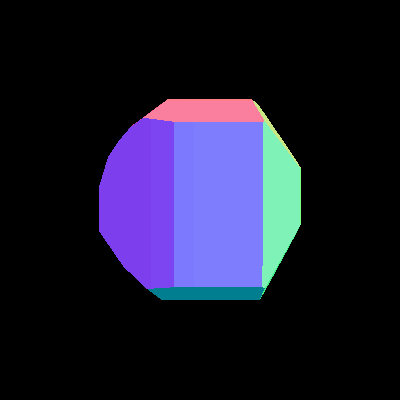
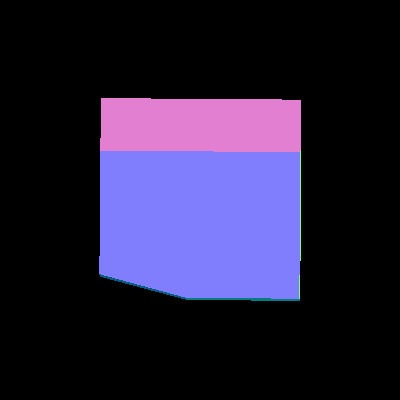
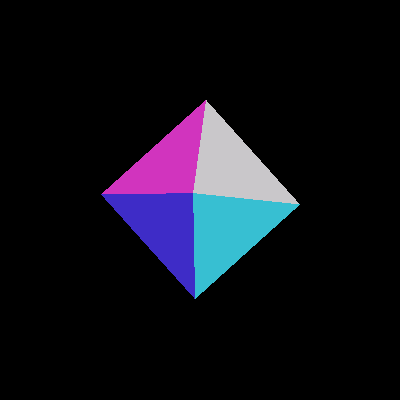

# high-volumes

ASL group project

[Final project report](./14_report.pdf)

[Sources we use for the Algorithm.](./doc/papers/README.md)







# Optimizations

[Lists of completed optimizations and ideas to try.](./OPTIMIZATIONS.md)


# dependencies

You must install: GLPK and
[Armadillo](http://arma.sourceforge.net/download.html)


# how to build:

```
mkdir build
cd build

cmake ..
make

#for debug mode:
cmake -DCMAKE_BUILD_TYPE=Debug ..

#make just your project with dependencies:
make peterem
```

never submit the build directory!

executables will end up in build/src

# use of C / C++

The volume library is compiled with C.
Currenly, peterem is compiled with C++.

# Running Tests

After you built, in the build directory:
```
./test/test.py
```
Or for a single test:
```
./test/test.py preprocess/test_preprocess
```


# Running Benchmarks

After you built, in the build directory:

```
./benchmark/benchmark.py
```

Or for a single benchmark:

```
./benchmark/benchmark.py benchmark_text_xyz_f
```

The output will be written into a file named after the corresponding test in directory build/benchmark/out
