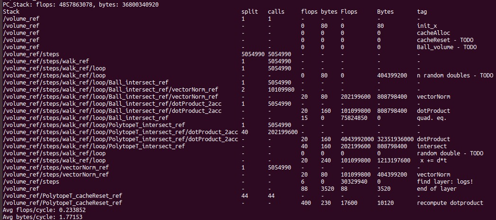

# Experiments Log

## Cross

´´´
benchmark/benchmark\_A1\_volume -b "r=1,polytopeTranspose=false,generator=cross\_rn\_8" -c "step\_size=1000000"
´´´ 

´´´ 
benchmark/benchmark\_A1\_volume -b "r=1,polytopeTranspose=false,generator=cross\_rn\_8" -c "step\_size=1000000" -f "walk\_f=walkCoord\_ref"
´´´ 
VTune measures the cost of cacheUpdateCoord surprisingly low, compared to pc calculations.

## Cube Rotated

´´´ 
benchmark/benchmark\_A1\_volume -b "r=1,polytopeTranspose=true,generator=cube\_rot\_r1.0\_20" -c "step\_size=1000000" -f "walk\_f=walkCoord\_ref"
´´´ 

Again, vtune says cacheUpdateCoord is not so expensive...

´´´ 
-b "r=1,polytopeTranspose=true,generator=cube\_rot\_r1.0\_100" -c "step\_size=1000000" -f "walk\_f=walkCoord\_ref"
´´´ 
Seems lots of time is spent on that one conditional... not sure if vtune measures this right.

´´´ 
benchmark/benchmark\_A1\_volume -b "r=1,polytopeTranspose=true,generator=cube\_rot\_r1.0\_10" -c "step\_size=1000000" -f "walk\_f=walk\_ref"
´´´ 
Cost of random is really expensive for random direction walk!

´´´
-b "r=1,polytopeTranspose=false,generator=cube\_rot\_r1.0\_100" -c "step\_size=10000" -f "walk\_f=walk\_ref" 
´´´
Also high costs for randomness with n=100.

 
