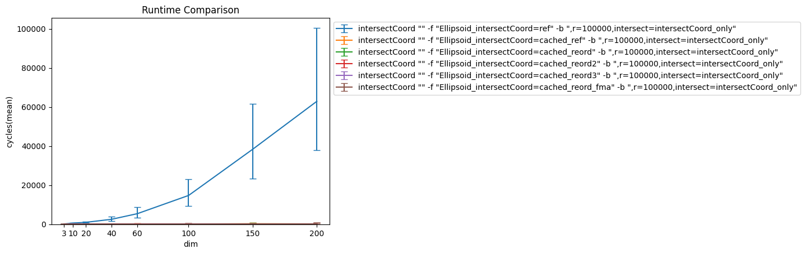
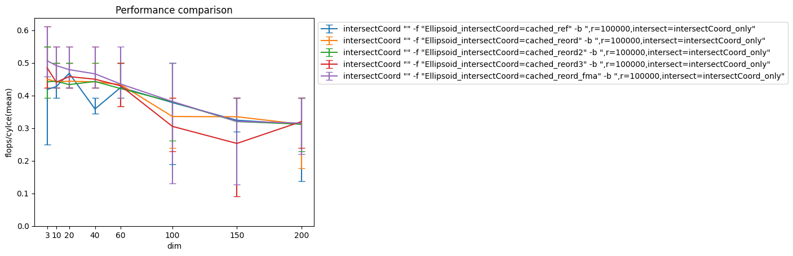
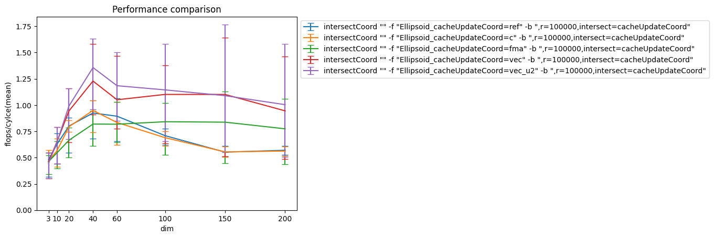
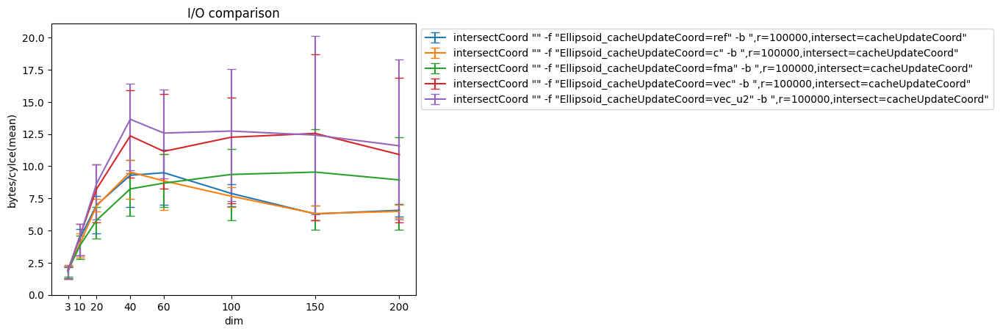
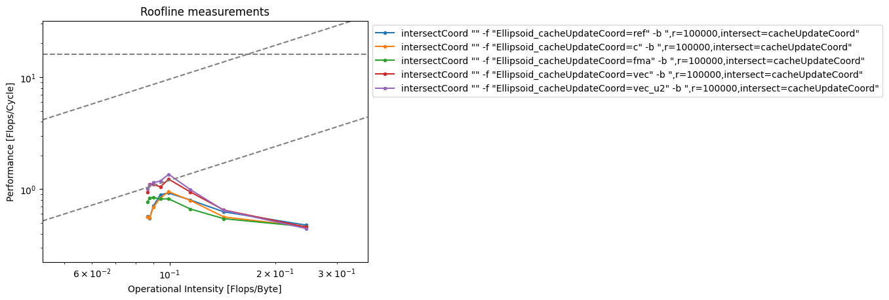
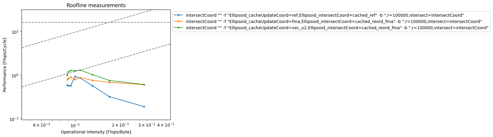

# Analysis Ellipsoid

## IntersectCoord

In the ellipsoid case, caching can be used to reduce the intersectCoord function from two nested loops of size n to the computation of a quadratic equation which can be done in constant time. The effect is visible in the plot below.

The performance improvements are limited by a division that follows a squareroot operation. Therefore we have a performance limit of 11flops in 40cycles (11 flops in 34 cycles on Skylake, measuremants for this analysis were done on a Skylake).

## CacheUpdate

For the cacheUpdate, we do not achieve the thoeretical performance roof which would be about 1.77 flops/cycle for n=100. We do not achieve this for any of our optimized implementations.

It ist interesting that the bytes that there seems to be a roof for the bytes loaded per cycle.

Looking at the corresponing memory roof in the roofline plot, we can see that the best two of our implementations reach the memory roof and then walking on the roof for higher dimensions (dimensions get larger from right to left).

## Intersect as a whole

If we look at the combination of the two, we obtain the following plot where we are using FMAs and vectorizations as optimizations over the cached reference implementation:

We still suffer from the memory roof that is imposed in the cacheUpdate part of the computation. It is less accentuated compared to the pure cacheUpdate plot, but it is still there and we can see, that we are able to hit the roof with our fastest implementation.