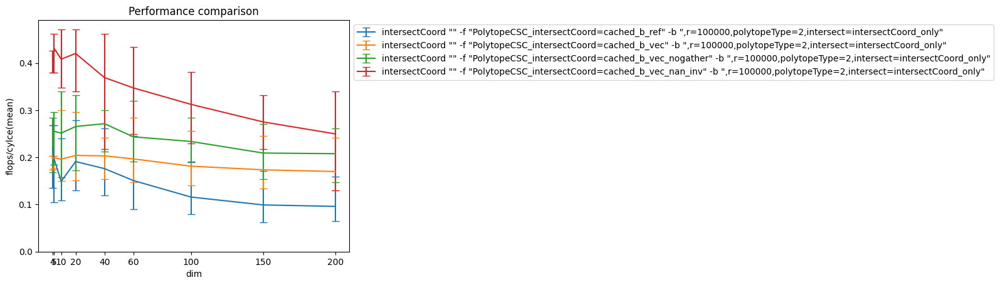
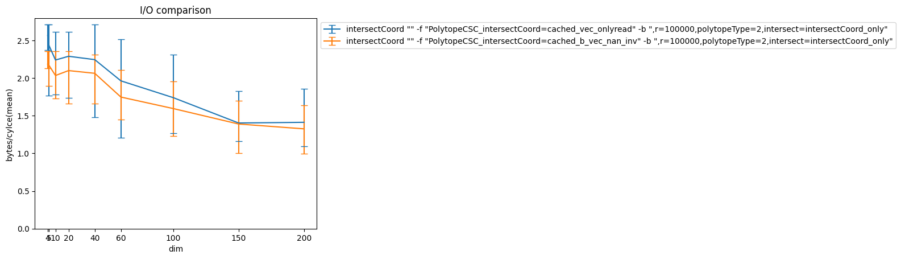
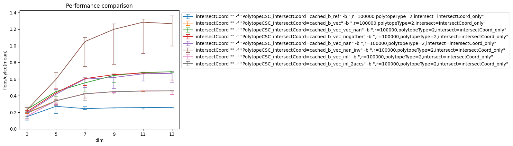
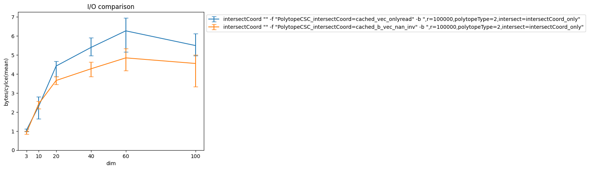
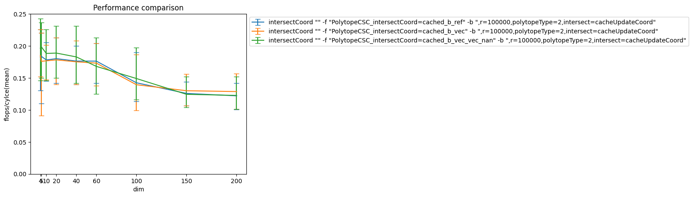
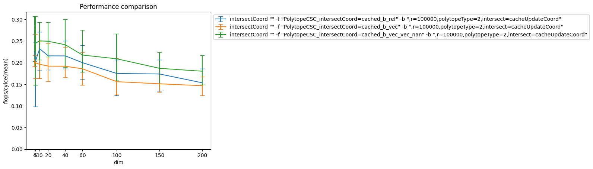
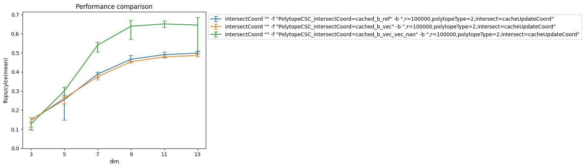

# Analysis PolytopeCSC

## IntersectCoord for sparse bodies (2var)

Let's first look at the performance of intersectCoord on the 2var bodies:

All implementations have b-Aix in cache, the lowest line is the implementation without vectorization, the next higher implementation 
uses the i32gather instruction to get the relevant elements of the cache, the next higher implementation loads those elements using
set_pd and the topmost implementation gets rid of the division by storing 1/A and multiplying.
Things to note:
- Getting rid of the division improves performance noticeably, but not as much as one might expect. This seems to be due to memory bound, see plot below.

The plot above shows bytes per cycles read by our fastest implementation (orange) and by a dummy implementation which accesses the same memory
locations but only computes a simple xor (with tp and lat of 1 this shouldn't limit the read speed, right?).
Things to note:
- It's probably not possible to do more io than the blue line -> we cannot get faster if we need to access the memory in this way

## IntersectCoord for dense bodies (cross polytope)

In order to see what performance could be possible we test with a polytope where our CSC columns are long (m = 2^n) and dense (note that
cross polytope has no zero entries)
     
Things to note:
- div has gap 27 and we do one div per loop. in one loop we do 16 ops, this gives us a roof of 16/27 ~ 0.6. This roof is achieved by the fastest implementation that uses div
- again using mul gives nice speedup. This time we don't reach memory roof exactly (c.f. again io test below).
- maybe this is due to the dependency between operations that need to be executed on the add port (cmp, max/min) -> ideas are appreciated
- theoretical memory roof for add port dependencies is 64/5 bytes/cycle
       

## CacheUpdate
Next let's consider the cache update, i.e. updating one element in the cache with the sum of the scaled elements of one column of A
The baseline implementation is the straightforward code, the next uses explicit FMAs and the third uses vectorization

First let's consider the very sparse 2var bodies

Things to note:
- we have no performance improvent due to using FMAs or vectorization at all.
- note that for sparse bodies we have very little non-zero elements per row, i.e. in cacheUpdate we make very few ops. Additionally we need to load random elements from memory (the cache) update them and then write them back. this suggests that this could already be the memory roof...
- base latency of runtime is about 200cycles (add runtime plot for 2var case). Where does latency come from?

To investigate this hypothesis we consider slightly denser bodies: 4var polytopes

Things to note:
- here we get a performance improvement for FMAs and a further improvement for vectorization
- the fact that we get some improvement but not great ones suggests that we are in fact doing very little ops and sit at the memory bound. In this case a bit less than in the 2var case but still.
 
The dense case here is not so glorious. Considering that what we do is actually simply an FMA we would hope for much more. But still
note that we basically need to gather from and scatter to memory, I guess this explains some part of the low performance. For PolytopeT it should be higher, right?

