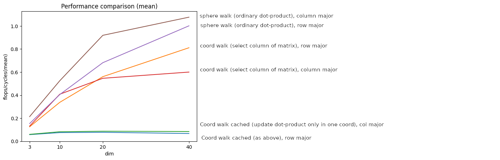
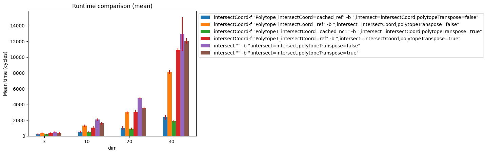
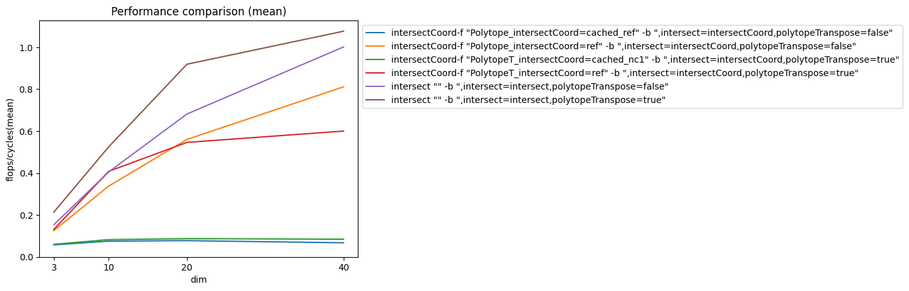

## Intersect performance and runtime

The performance of our optimized functions is worse than baseline functions

But the work is also massively decreased, thus we good runtime improvement. 

Also there is a lot of room to increase performance (e.g. with vectorization)

(For comleteness the performance plot with original labels)
